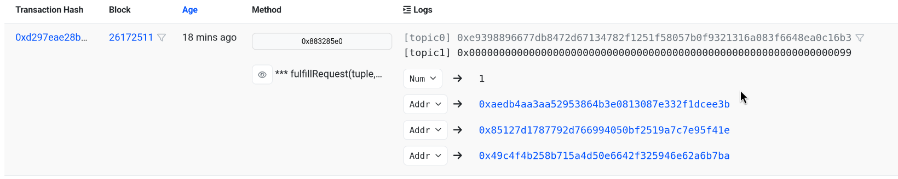

# Millionaires Dilemma

Finds max balance of participant without revealing their actual balance, computation happens on encrypted data.

## Demo

- Smart Contract and Test Overview

  <p align="center">
    <a href="https://youtu.be/rRi7cJblBQU">
      
    </a>
  </p>

- Frontend Tour and Integration

  <p align="center">
    <a href="https://www.youtube.com/watch?v=ksXiUM4aWlk">
      
    </a>
  </p>

- Deployment address, event logs, and async fulfillRequest
  - [Deployed at](https://sepolia.basescan.org/address/0x6C128287f051783F39729B482FF6D6FE926fF8da)
  - [Event logs](https://sepolia.basescan.org/address/0x6C128287f051783F39729B482FF6D6FE926fF8da#events)
  - fulfillRequest from inco screenshot: - 1 signifies, it's a tie - rest three addresses are all participants - topic 1, that is the winner.
    <p align="center">
    
  </p>

## How i replicated the setup?

I have cloned [lightning-rod](https://github.com/Inco-fhevm/lightning-rod) and [nextjs-template](https://github.com/Inco-fhevm/nextjs-template.git) templates of inco and just added my Contract [here](./contracts/src/MillionairesDilemma.sol) and added my Test file [here](./contracts/src/test/MillionairesDilemma.t.sol).

For building my contract from `contracts` dir I ran `forge build src/MillionairesDilemma.sol`

And for testing the contract functionality, cases and flow from the `contracts` dir I ran `forge test --match-path src/test/MillionairesDilemma.t.sol`, it logs:

```
Ran 9 tests for src/test/MillionairesDilemma.t.sol:TestMillionairesDilemma
[PASS] testAllDifferent() (gas: 1564248)
[PASS] testAllSame() (gas: 1631053)
[PASS] testIfAllValueCleanedAfterFindWhoIsRich() (gas: 1635329)
[PASS] testTwoMaxAndSameThirdMin() (gas: 1551221)
[PASS] testTwoMinAndSameThirdMax() (gas: 1544057)
[PASS] testUserCanAccessOwnBalance() (gas: 638629)
[PASS] test_RevertWhen_Participate_Less_Than_Three_People() (gas: 346022)
[PASS] test_RevertWhen_Participate_More_Than_Three_People() (gas: 1016225)
[PASS] test_RevertWhen_UnAuth_Access_Find_Who_Is_Rich() (gas: 540017)
Suite result: ok. 9 passed; 0 failed; 0 skipped; finished in 7.86ms (23.50ms CPU time)

Ran 1 test suite in 10.83ms (7.86ms CPU time): 9 tests passed, 0 failed, 0 skipped (9 total tests)
```

and for seeing the result/logs, `forge test --match-path src/test/MillionairesDilemma.t.sol -vvv`

And for frontend I have used inco [nextjs-starter-repo](https://github.com/Inco-fhevm/nextjs-template.git), changed the things a little with minor tweaks. I've used the wallet adaptor as it is.

My main components exist in components [folder](./frontend/src/components/) and both the files are the core of application
